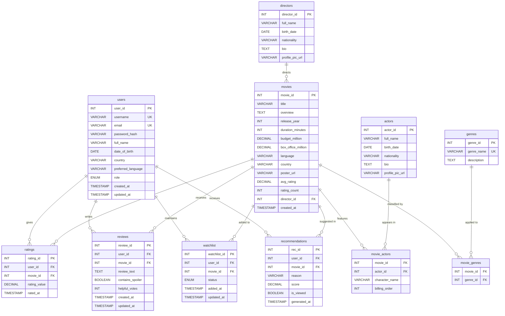

# CineMatch — Entity Relationship Diagram

> **Document Version:** 1.0  
> **Last Updated:** July 2026  
> **Project:** CineMatch — Movie Recommendation & Analytics System

---

## 1. ER Diagram (Mermaid)

---

## 2. Relationship Descriptions

### 2.1 users → ratings (1 : N)
- A **user** can give **zero or many ratings**, but each **rating** belongs to exactly **one user**.
- Combined with `movie_id`, the pair `(user_id, movie_id)` is unique — a user can rate a movie only once.
- **Cascade Rule:** If a user is deleted, all their ratings are deleted (`ON DELETE CASCADE`).

### 2.2 users → reviews (1 : N)
- A **user** can write **zero or many reviews**, but each **review** is authored by exactly **one user**.
- A user may write at most one review per movie (enforced via `UNIQUE(user_id, movie_id)`).
- **Cascade Rule:** Deleting a user cascades to delete all their reviews.

### 2.3 users → watchlist (1 : N)
- A **user** can have **zero or many movies** in their watchlist.
- Each **watchlist entry** belongs to exactly **one user** and references exactly **one movie**.
- **Cascade Rule:** Deleting a user removes all their watchlist entries.

### 2.4 users → recommendations (1 : N)
- A **user** can receive **zero or many recommendations** generated by the system.
- Each **recommendation** targets exactly **one user** and references exactly **one movie**.

### 2.5 movies → ratings (1 : N)
- A **movie** can receive **zero or many ratings**.
- `movies.avg_rating` and `movies.rating_count` are denormalized aggregates updated via trigger for fast reads.

### 2.6 movies → reviews (1 : N)
- A **movie** can have **zero or many reviews** written by different users.

### 2.7 movies → watchlist (1 : N)
- The same **movie** can appear in the watchlists of **many users**.

### 2.8 directors → movies (1 : N)
- A **director** can direct **zero or many movies**, but each **movie** has exactly **one director**.
- `movies.director_id` is a non-nullable foreign key referencing `directors.director_id`.

### 2.9 movies ↔ genres (M : N) via movie_genres
- A **movie** can belong to **multiple genres** (e.g., Action + Thriller).
- A **genre** can be applied to **many movies**.
- The **junction table** `movie_genres` resolves this M:N relationship with a composite primary key `(movie_id, genre_id)`.

### 2.10 movies ↔ actors (M : N) via movie_actors
- A **movie** can feature **multiple actors**.
- An **actor** can appear in **multiple movies**.
- The **junction table** `movie_actors` stores additional attributes: `character_name` and `billing_order`.

---

## 3. Key Design Decisions

### 3.1 Surrogate Primary Keys
All primary tables use auto-incremented integer surrogate keys (`INT AUTO_INCREMENT`) rather than natural keys. This ensures:
- Stable join performance (small integer joins vs. VARCHAR joins).
- Flexibility to change natural identifiers (e.g., username) without cascading updates.
- Simple, predictable API URL structures (e.g., `/api/movies/42`).

### 3.2 Denormalized Aggregates on movies
The `movies` table stores `avg_rating` (DECIMAL 3,2) and `rating_count` (INT). These are technically redundant since they can be derived from the `ratings` table, but are maintained via an `AFTER INSERT / AFTER UPDATE / AFTER DELETE` trigger on `ratings`. This trade-off avoids expensive full-table aggregations on every page load.

### 3.3 Junction Tables for M:N Relationships
- `movie_genres` stores only the composite FK pair — no surrogate key needed.
- `movie_actors` stores additional relationship attributes (`character_name`, `billing_order`), making it a true **associative entity** rather than a pure junction table.

### 3.4 ENUM Fields for Constrained String Values
- `users.role` uses `ENUM('user','admin')` to enforce valid roles at the database level.
- `watchlist.status` uses `ENUM('want_to_watch','watching','watched')` to restrict status values.

### 3.5 Soft Timestamps vs. Hard Deletes
All major tables include `created_at TIMESTAMP DEFAULT CURRENT_TIMESTAMP` and where appropriate `updated_at TIMESTAMP DEFAULT CURRENT_TIMESTAMP ON UPDATE CURRENT_TIMESTAMP`. This provides an audit trail without requiring a separate history table.

### 3.6 Cascade Delete Strategy
All foreign keys from user-owned entities (ratings, reviews, watchlist, recommendations) cascade on user deletion. Movie-entity foreign keys (movie_actors, movie_genres) also cascade on movie deletion. This prevents orphaned records and simplifies application-level delete logic.

### 3.7 Normalization Level: 3NF
The schema is designed to satisfy **Third Normal Form (3NF)**:
- Every non-key attribute is fully functionally dependent on the primary key (no partial dependencies — 2NF).
- No transitive dependencies exist (non-key attributes do not determine other non-key attributes — 3NF).
- See the Project Report for detailed normalization proofs.

### 3.8 Index Strategy
Beyond primary key indexes, the following indexes are created:
- `movies(release_year)` — for year-based filtering.
- `movies(language)` — for language-based filtering.
- `ratings(movie_id)` — for aggregation queries.
- `ratings(user_id)` — for user history queries.
- `reviews(movie_id)` — for review listing.
- `watchlist(user_id, status)` — composite index for filtered watchlist queries.

---

## 4. Table Summary

| Table             | Type               | Primary Key              | Foreign Keys              | Rows (Est.) |
|-------------------|--------------------|--------------------------|---------------------------|-------------|
| `users`           | Entity             | `user_id`                | —                         | 500+        |
| `movies`          | Entity             | `movie_id`               | `director_id`             | 200+        |
| `genres`          | Entity             | `genre_id`               | —                         | ~20         |
| `directors`       | Entity             | `director_id`            | —                         | 100+        |
| `actors`          | Entity             | `actor_id`               | —                         | 500+        |
| `movie_genres`    | Junction           | `(movie_id, genre_id)`   | `movie_id`, `genre_id`    | 400+        |
| `movie_actors`    | Associative Entity | `(movie_id, actor_id)`   | `movie_id`, `actor_id`    | 600+        |
| `ratings`         | Interaction        | `rating_id`              | `user_id`, `movie_id`     | 2000+       |
| `reviews`         | Interaction        | `review_id`              | `user_id`, `movie_id`     | 800+        |
| `watchlist`       | Interaction        | `watchlist_id`           | `user_id`, `movie_id`     | 1500+       |
| `recommendations` | System Output      | `rec_id`                 | `user_id`, `movie_id`     | 1000+       |

---

*End of ER Diagram Document*
